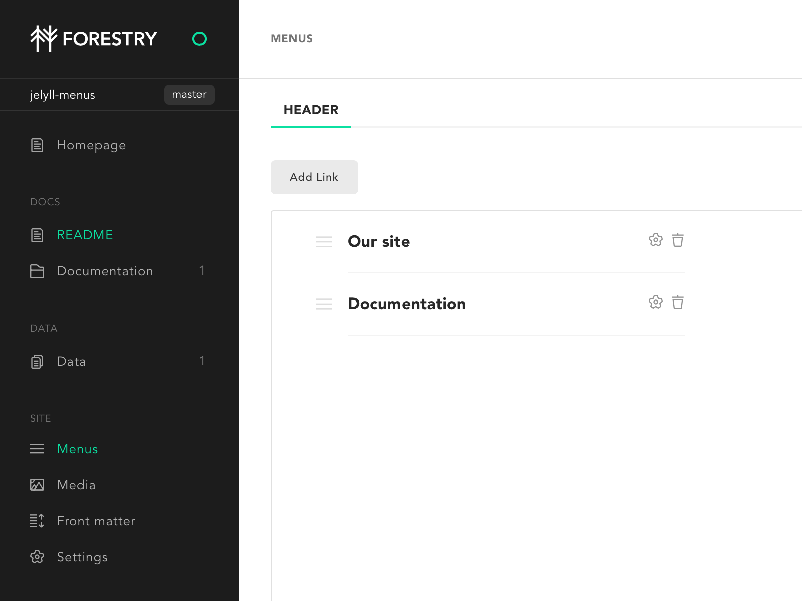

# Docs

This is a basic example of using [jekyll-menus](https://github.com/forestryio/jekyll-menus#jekyll-menus) plugins with [Forestry](https://forestry.io).

We added some front matter on our [main index page](index.md):

```yaml
menus:
  header:
    weight: 1
```

We also say we want to display a link to our documentation in the header menu via [_data/menus.yml](_data/menus.yml):

```yaml
header:
  - url: /docs
    title: Documentation
    identifier: docs
    weight: 2
```

To display our menu we use a simple loop in [our layout](_layouts/default.html):

```liquid
<ul>

  <li>
    <a href="{{ item.url }}" }}">{{ item.title }}</a>
  </li>

</ul>
```

You can modify menus in Forestry:


